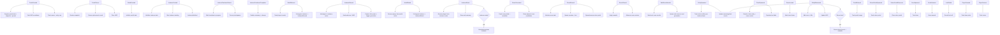

# Event Flow (Proposed)

```mermaid
flowchart TD
    PortalCreated[PortalCreated] --> PReg[Register portal state + snapshot + persist]
    PortalCreated --> PHud[Start HUD countdown]
    PortalCreated --> PTrack[Track owner + entry cap]

    PortalClosed[PortalClosed] --> PRestore[Restore snapshot]
    PortalClosed --> PClear[Remove placement record]
    PortalClosed --> PHudClear[Clear HUD]

    WorldCreated[WorldCreated] --> WInit[Initialize world state]

    InstanceCreated[InstanceCreated] --> IState[Initialize instance state]
    InstanceCreated --> ITrack[Start instance tracking]
    InstanceCreated --> IInit[InstanceInitialized]

    InstanceTeardownStarted[InstanceTeardownStarted] --> ITeardownState[Mark teardown in progress]
    InstanceTeardownStarted --> IFreeze[Freeze joins/spawns]
    InstanceTeardownCompleted[InstanceTeardownCompleted] --> IFinal[Finalize summary + cleanup]

    WorldEntered[WorldEntered] --> WTrack[Track player in world]
    WorldEntered --> IEntered[If dungeon instance -> InstanceEntered]

    InstanceEntered[InstanceEntered] --> IJoin[Add player to instance roster]
    InstanceEntered --> IWelcome[Send welcome / HUD]
    InstanceEntered --> ISpawn[Capture first spawn + trigger generation]

    WorldExited[WorldExited] --> WUntrack[Remove player from world roster]
    WorldExited --> IExited[If dungeon instance -> InstanceExited]

    InstanceExited[InstanceExited] --> ILeave[Remove player from instance roster]
    InstanceExited --> ISummary[Show exit summary]
    InstanceExited --> IClose{Instance empty?}
    IClose -->|yes| ITeardown[Schedule/teardown instance]

    RoomGenerated[RoomGenerated] --> RTrack[Track room prefab + metadata]
    RoomGenerated --> RAdj[Prime adjacent room candidates]

    RoomEntered[RoomEntered] --> RActivate[Activate room state]
    RoomEntered --> RSpawn[Spawn enemies + loot]
    RoomEntered --> RPortal[Spawn/remove return portal]

    RoomCleared[RoomCleared] --> RReward[Apply rewards]
    RoomCleared --> RSweep[Advance room counters]

    SafeRoomNeeded[SafeRoomNeeded] --> RPlan[Mark next room as safe]
    SafeRoomNeeded --> RSpawnSafe[Spawn safe room on next generation]

    EntitySpawned[EntitySpawned] --> ETrack[Track active entities per instance/room]
    EntitySpawned --> ECount[Update remaining/total counts]

    ChestSpawned[ChestSpawned] --> CLocate[Resolve chest entity + room context]
    ChestSpawned --> CLoot[Populate loot table]

    RoomLooted[RoomLooted] --> CLootTrack[Mark chest looted]

    EntityEliminated[EntityEliminated] --> EScore[Add score + kills]
    EntityEliminated --> EHud[Update HUD]
    EntityEliminated --> ECount
    EntityEliminated --> RClear{Room clear?}
    RClear -->|yes| REvent[Room cleared event + rewards]

    PortalEntered[PortalEntered] --> PUse[Track portal usage]
    ReturnPortalSpawned[ReturnPortalSpawned] --> RPortalTrack[Track return portal]
    ReturnPortalRemoved[ReturnPortalRemoved] --> RPortalClear[Clear return portal]

    BossSpawned[BossSpawned] --> BTrack[Track boss]
    BossDefeated[BossDefeated] --> BReward[Boss rewards]

    LootRolled[LootRolled] --> LTrace[Record loot roll]

    PlayerDowned[PlayerDowned] --> PDown[Track down state]
    PlayerRevived[PlayerRevived] --> PRevive[Track revive]
```
